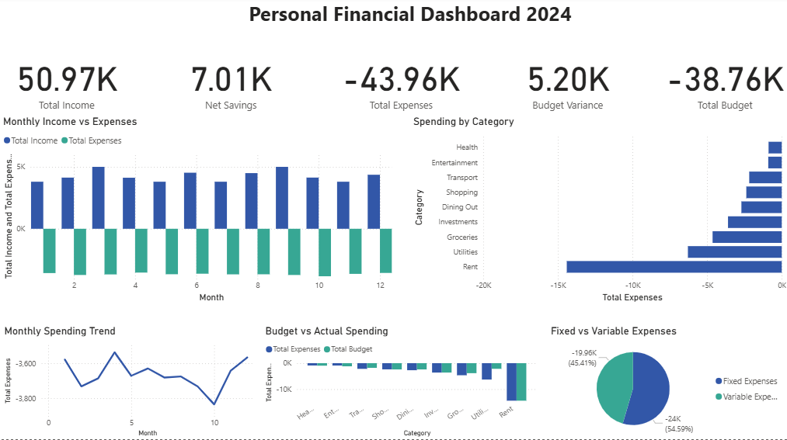

# Personal Finance & Wealth Audit Dashboard 

## The Story Behind This Project
Since university, I struggled with something almost every student does but nobody really talks about: managing money properly.
It was never about not earning enough. It was about having zero visibility into where the money was actually going. No structure, no budget, no clarity. Just that uncomfortable feeling at the end of the month that something did not add up. My friends were in the exact same boat, and the only advice we ever got from our parents was "please make a budget!" Which, of course, nobody actually did.
Fast forward to working life, and that same habit quietly follows you. Except now the stakes are higher. You have one source of income, responsibilities are growing, and before you know it people start depending on you financially. What felt like a small problem in college turns into something that actually matters.
So I decided to stop guessing and start analysing.
Instead of building a spreadsheet I would abandon in two weeks, I built a proper end-to-end data pipeline using the same tools used in real analytics environments, and applied it to my own personal finances. The goal was simple: give myself brutal, honest clarity. No rounding up, no excuses. Just the numbers, laid out clearly enough that I could finally give myself and the people around me real financial advice backed by actual data.

---

## What This Project Does

This dashboard tracks 392 transactions across 12 months of 2024, covering income, fixed expenses, variable expenses, savings and investments. It answers questions like:

- Where is my money actually going every month?
- Which categories am I consistently overspending in?
- How does my actual spending compare to what I budgeted?
- What does my savings picture look like across the year?
- What were my biggest unplanned expenses?

---

## Project Architecture

Raw Data -> Python (Cleaning) -> SQLite (Analysis) -> Power BI (Visualisation)

This follows a real-world data analytics pipeline, from raw messy data all the way to an interactive dashboard.

## Tools and Technologies

| Tool | Purpose
|---|---|
| Python (Pandas) | Data cleaning and feature engineering | 
| SQL (SQLite) | Analytical queries and financial aggregations | 
| Power BI + DAX | Data modelling, KPI measures and interactive dashboard |
| GitHub | Version control and project documentation |

---

## Dataset

- 392 transactions across 12 months (January to December 2024)
- Categories: Income, Rent, Groceries, Transport, Dining Out, Entertainment, Health, Shopping, Savings, Investments
- Transaction types: Fixed, Variable, Income

---

## Key Financial Metrics (2024)

| Metric | Value |
|---|---|
| Total Income | £50,973.14 |
| Total Expenses | £43,961.06 |
| Net Savings | £7,012.08 |
| Total Budgeted | £38,759.52 |
| Budget Variance | £5,201.54 |

---

Dashboard Preview

---

## Key Insights

- 55% of expenses were fixed (Rent, Investments, Savings), leaving 45% as variable and controllable spending
- Utilities consistently exceeded budget across multiple months, flagged as a key area for cost reduction
- March saw the highest income month due to a quarterly bonus, highlighting the value of tracking irregular income
- The top 5 biggest single expenses were all utility and transport related, not lifestyle spending as expected
- Net savings of £7,012 over 12 months works out to roughly £584 saved per month on average

---

## What I Learned

The most valuable thing data can do is remove the excuses. When you can see exactly where every pound went, you stop guessing and start making actual decisions. That shift from guessing to deciding is what financial clarity really feels like. And if this dashboard can do that for me, it can do it for anyone.

---

- Automate monthly data ingestion using Python scheduling
- Add forecasting to predict next month's expenses based on trends
- Football player performance analysis is already lined up as the next project

## About

Aspiring data analyst focused on building real-world, end-to-end projects that solve genuine problems. Currently expanding into financial analysis, sports analytics and business intelligence.

[Connect with me on LinkedIn](https://www.linkedin.com/in/mohammad-yasa-5512b2363/) | Star this repo if you found it useful!
